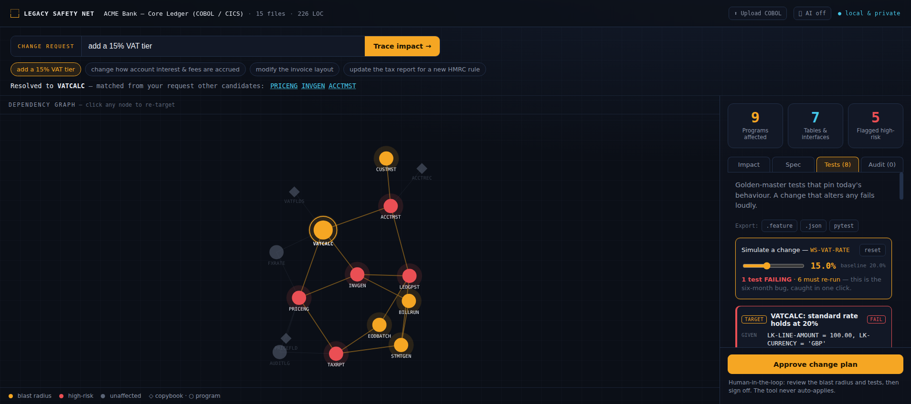

# Legacy Safety Net

**Change decades-old code without breaking it.** Point it at a legacy module and get a
plain-English spec, a live dependency / blast-radius map, and characterization tests that
pin its current behaviour — then *watch a proposed change turn a test red before you ship it*.

Built for the **Conduct "Make Legacy Move"** track — UK AI Agent Hackathon EP5.

- **Live app:** https://legacy-safety-net.vercel.app
- **ASI:One agent (Fetch.ai):** `agent1qgn725myvj44pxv7ksy77a3j5e05ct4u39rf6kvcpuzgvx2clq7524wc0pa` (see [`fetch-agent/`](fetch-agent/))



---

## The problem

Large enterprises run on millions of lines of custom code with little documentation and few
people who still understand it. Because a module is *undocumented and untested*, every change
is a gamble — so nobody touches it, and a two-day change turns into a six-month project.

## What it does

Given a plain-English change request (e.g. *"add a 15% VAT tier"*), Legacy Safety Net:

1. **Resolves** the request to the program most likely to change.
2. **Traces the blast radius** — every program that transitively depends on it, with the exact
   dependency path and a risk flag, computed from the real call-graph.
3. **Documents** the target — a spec grounded in source, every claim cited to `file:line`,
   including the business constants a change is likely to touch (e.g. the VAT rate literal).
4. **Protects** it — generates golden-master *characterization tests* that lock in today's
   behaviour, so a change that alters it fails loudly instead of shipping silently.
5. **Keeps the human in control** — nothing auto-applies; the engineer reviews and approves,
   and every approval is logged to an audit trail.

## Interactive features

| Feature | What it does |
|---|---|
| **Simulate a change** | Drag the target's constant (e.g. the VAT rate); each test re-evaluates live as **PASS / FAIL / STALE**, the graph **pulses the target red**, and a **grounded diff** of the proposed edit appears. *"The six-month bug, caught in one click."* |
| **Test coverage** | Shows how many high-risk blast-radius paths have a pinning test ("5 of 5"). |
| **Export tests** | Download the characterization tests as Gherkin `.feature`, a JSON golden-master, or a **runnable pytest** (the computable cases actually execute). |
| **Export change plan** | One-click Markdown change plan: blast radius, risk register, ordered execution steps, and a sign-off block. |
| **Provenance peek** | Click any citation → view the exact `.cbl` source lines, with the referenced line highlighted. Grounded, not hallucinated. |
| **Audit log** | Each approval is logged with a content hash and timestamp (localStorage-persisted), exportable as a traceability record. |
| **Upload your own COBOL** | Drag in `.cbl` / `.cpy` files → the app parses them live and swaps in your own repo. All in the browser — nothing is uploaded. |
| **AI enhancement (optional)** | Paste an Anthropic key to enrich the spec prose and fuzzier request→program matching; falls back to the deterministic engine if unset. |

## Why it's different

- **Provably safe, not just "impact analysis."** Other tools *show* what a change touches; we
  generate the tests that prove your fix didn't break it — and demonstrate one **failing** on screen.
- **Grounded, not hallucinated.** The graph is parsed from the actual source (`CALL` / `PERFORM`
  / `COPY` / `EXEC SQL`), not guessed by an LLM. Every claim links to `file:line`.
- **Local & private.** Parsing (and even file upload) runs entirely in the browser — no code leaves the machine.
- **Human keeps the pen.** Approval gates + an audit trail; the tool never auto-applies.

---

## Run it

```bash
npm install
npm run dev      # http://localhost:5173
npm run build    # typecheck + production build
```

## Demo script (≈2 min)

1. Land on **"add a 15% VAT tier"** — the graph lights up: **VATCALC** ripples to **9 programs**
   across **7 interfaces**, **5 flagged high-risk**.
2. Open **Tests** → drag the **Simulate** slider to 15% → the target test flips to **FAIL**:
   *"that's the six-month bug, caught in one click."* Note the boundary test stays PASS and the
   downstream tests go STALE (must re-run).
3. Open **Spec** → click the constant `WS-VAT-RATE = 0.200` → the source peek shows
   `src/VATCALC.cbl:13` highlighted — line-level evidence, not a summary.
4. **Export** the tests (pytest) and the **change plan** (.md) — tangible artifacts.
5. **Approve change plan** → logged to the **Audit** tab with a hash. *Nothing was applied.*
6. (Optional) **Upload COBOL** → parse your own code live.

Talking point: *"Tracing this by hand is 6–8 weeks and still misses things. Here it's live,
grounded in the code, and provably safe to act on."*

---

## How it works

```
src/
  sample/cbsa.ts        A realistic COBOL core-banking module (parsed live)
  engine/
    parser.ts           COBOL → nodes + edges + sources, with file:line provenance
    graph.ts            reverse-reachability blast radius + risk scoring + request→target
    spec.ts             plain-English spec + business constants, grounded in source
    tests.ts            golden-master characterization test scaffolds
    simulate.ts         re-evaluate tests against a proposed constant → PASS/FAIL/STALE
    export.ts           change-plan Markdown + test export (Gherkin / JSON / pytest)
    llm.ts              optional Claude enhancement (with deterministic fallback)
    analyze.ts          orchestrates parse → resolve → blast → spec → tests (swappable repo)
  components/
    GraphView.tsx       interactive force-graph, coloured by blast state
    SourcePeek.tsx      source-provenance modal
  App.tsx               workspace UI (query · graph · impact/spec/tests/audit · simulate · approval)
```

The core pipeline is **deterministic** and needs no API key or network — the demo cannot fail
on a flaky model call. The LLM layer is a drop-in enhancement on top of this grounded core.

## Scope & honesty

- The bundled sample is a compact, hand-written COBOL banking module chosen to be parseable and
  legible. The parser is real (and handles fixed-format sequence numbers / col-7 comments); on a
  larger corpus (e.g. the CICS Banking Sample App, or Java via a swapped grammar) the same engine applies.
- Metrics shown (9 / 7 / 5) are **computed live** from the sample, not hard-coded.
- "Runnable" test export: the computable cases (the VAT math) genuinely run under pytest; opaque
  golden-masters are emitted as `xfail` stubs pending a program runner — no overclaiming.

## Roadmap

COBOL today → **SAP / ABAP** and the 2027 S/4HANA migration → any legacy stack. CI gate that
blocks a PR when a characterization test breaks. Multi-agent crew via Coral. Discoverable as an
agent on **ASI:One (Fetch)** for the conversational entry point.
