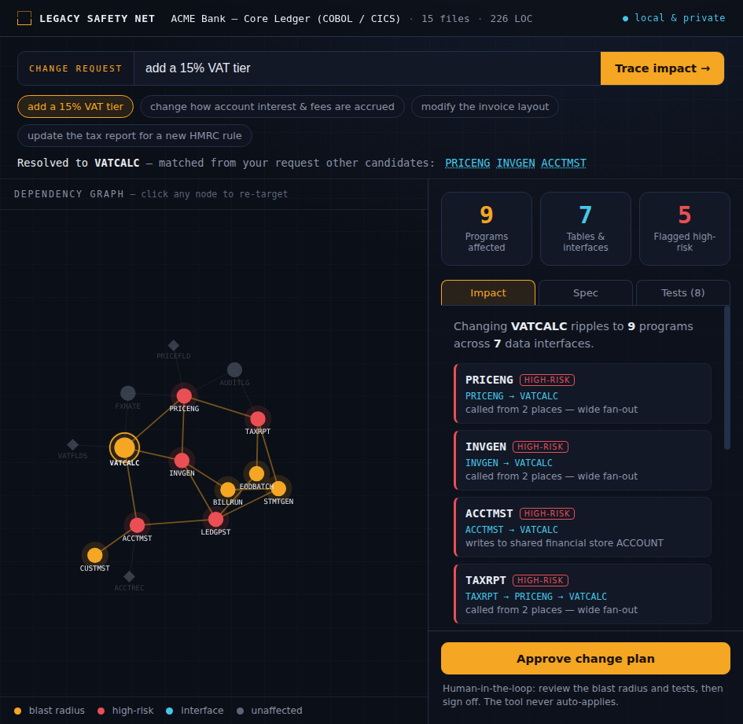

# Legacy Safety Net

**Change decades-old code without breaking it.** Point it at a legacy module and get a
plain-English spec, a live dependency / blast-radius map, and characterization tests that
pin its current behaviour — so an engineer can finally change it safely.

Built for the **Conduct "Make Legacy Move"** track — UK AI Agent Hackathon EP5.



---

## The problem

Large enterprises run on millions of lines of custom code with little documentation and few
people who still understand it. Because a module is *undocumented and untested*, every change
is a gamble — so nobody touches it, and a two-day change turns into a six-month project.

## What it does

Given a plain-English change request (e.g. *"add a 15% VAT tier"*), Legacy Safety Net:

1. **Resolves** the request to the program most likely to change.
2. **Traces the blast radius** — every program that transitively depends on it, with the exact
   dependency path and a risk flag, computed from the real call-graph.
3. **Documents** the target — a spec grounded in source, every claim cited to `file:line`,
   including the business constants a change is likely to touch (e.g. the VAT rate literal).
4. **Protects** it — generates golden-master *characterization tests* that lock in today's
   behaviour, so a change that alters it fails loudly instead of shipping silently.
5. **Keeps the human in control** — nothing auto-applies; the engineer reviews and approves.

## Why it's different

- **Grounded, not hallucinated.** The graph is parsed from the actual source (`CALL` / `PERFORM`
  / `COPY` / `EXEC SQL`), not guessed by an LLM. Every claim links to `file:line`.
- **The safety net others skip.** It generates the tests, not just a diff.
- **Local & private.** Parsing runs entirely in the browser — no code leaves the machine.

---

## Run it

```bash
npm install
npm run dev      # http://localhost:5173
npm run build    # typecheck + production build
```

## Demo script (≈2 min)

1. Land on **"add a 15% VAT tier"** — the graph lights up: **VATCALC** (target) ripples to
   **9 programs** across **7 interfaces**, **5 flagged high-risk**.
2. Open **Spec** → point at the extracted constant `WS-VAT-RATE = 0.200` cited to
   `src/VATCALC.cbl:13` — *"this is the exact literal your change touches, and here's where."*
3. Open **Tests** → the target test pins `VAT = 20.00` on £100 — *"change the rate and this
   fails loudly."*
4. Click **TAXRPT** (or the chips) to re-target and watch the blast radius recompute live.
5. Hit **Approve change plan** → *"logged, nothing applied — the engineer keeps the pen."*

Talking point: *"Tracing this by hand is 6–8 weeks and still misses things. Here it's live,
grounded in the code, and safe to act on."*

---

## How it works

```
src/
  sample/cbsa.ts        A realistic COBOL core-banking module (parsed live)
  engine/
    parser.ts           COBOL → nodes + edges, with file:line provenance
    graph.ts            reverse-reachability blast radius + risk scoring + request→target
    spec.ts             plain-English spec, grounded in source
    tests.ts            golden-master characterization test scaffolds
    analyze.ts          orchestrates parse → resolve → blast → spec → tests
  components/GraphView.tsx   interactive force-graph, coloured by blast state
  App.tsx               workspace UI (query · graph · impact/spec/tests · approval)
```

The entire pipeline is **deterministic** and needs no API key or network — the demo cannot
fail on a flaky model call. An LLM layer (richer prose specs, fuzzier request→node matching)
is a drop-in enhancement on top of this grounded core, not a dependency.

## Scope & honesty

- The bundled sample is a compact, hand-written COBOL banking module chosen to be parseable and
  legible. The parser is real; on a larger corpus (e.g. the CICS Banking Sample App, or Java via
  a swapped grammar) the same engine applies.
- Metrics shown (9 / 7 / 5) are **computed live** from the sample, not hard-coded.

## Roadmap

COBOL today → **SAP / ABAP** and the 2027 S/4HANA migration → any legacy stack.
Discoverable as an agent on **ASI:One (Fetch)** for the conversational entry point.
